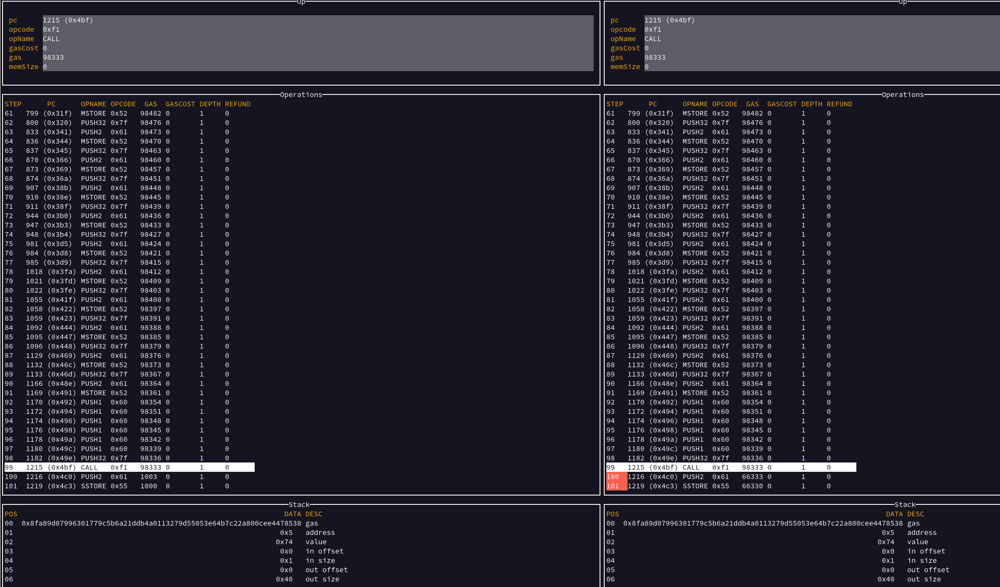

### Consensus error

This is a consensus error affecting `nimbus-eth1`.
This happens on a call to the precompile at `0x5`, `bigModExp`. Nimbus returns a `0x1` (SUCCESS) on the stack, `geth` returns `0x0` (FAIL) on the stack.

```
$ ./runtest --geth ~/workspace/evm --nimbus ~/workspace/evmstate  ../minimizer/00003745-mixed-0.json 
INFO [12-15|11:07:54.801] Processing tests                         count=0 remaining=1 elapsed="77.642µs" current=../minimizer/00003745-mixed-0.json
diff: 
         geth-0: {"pc":1216,"op":97,"gas":"0x3eb","gasCost":"0x0","memSize":0,"stack":["0x5ff5bec51f2db9d89358edce3060544dc05ec653eccca2e6752cf0eb793849fa","0x74e05d0a4e2d4e66e8c2b19b6909288861160b0f2a48e2f317c85e8ab8074af2","0x0"],"depth":1,"refund":0,"opName":"PUSH2"}
         nimb-0: {"pc":1216,"op":97,"gas":"0x1031d","gasCost":"0x0","memSize":0,"stack":["0x5ff5bec51f2db9d89358edce3060544dc05ec653eccca2e6752cf0eb793849fa","0x74e05d0a4e2d4e66e8c2b19b6909288861160b0f2a48e2f317c85e8ab8074af2","0x1"],"depth":1,"refund":0,"opName":"PUSH2"}
Consensus error
Testcase: ../minimizer/00003745-mixed-0.json
- geth-0: ./geth-0-output.jsonl
  - command: /home/martin/workspace/evm --json --noreturndata --nomemory statetest ../minimizer/00003745-mixed-0.json
- nimb-0: ./nimb-0-output.jsonl
  - command: /home/martin/workspace/evmstate --json --noreturndata --nomemory --nostorage ../minimizer/00003745-mixed-0.json
```


### Fix 

This was fixed in [#1394](https://github.com/status-im/nimbus-eth1/pull/1394)